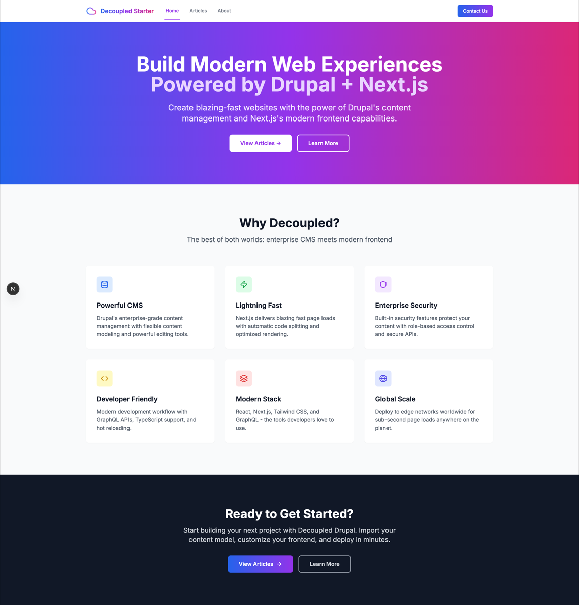

# Decoupled Wedding

A wedding website starter template for Decoupled Drupal + Next.js. Built for couples who want a beautiful, modern wedding website with event details, love story timeline, RSVP information, and guest resources.



## Features

- **Events** - Share wedding weekend events including ceremony, reception, welcome dinner, and after-party with venue details, times, and dress codes
- **Our Story** - Tell your love story through a timeline of chapters with dates, locations, and photos
- **RSVP & Info** - Provide RSVP details, accommodation options, travel information, and things to do for guests
- **Modern Design** - Clean, elegant UI optimized for wedding and celebration content

## Quick Start

### 1. Clone the template

```bash
npx degit nextagencyio/decoupled-wedding my-wedding
cd my-wedding
npm install
```

### 2. Run interactive setup

```bash
npm run setup
```

This interactive script will:
- Authenticate with Decoupled.io (opens browser)
- Create a new Drupal space
- Wait for provisioning (~90 seconds)
- Configure your `.env.local` file
- Import sample content

### 3. Start development

```bash
npm run dev
```

Visit [http://localhost:3000](http://localhost:3000)

---

## Manual Setup

If you prefer to run each step manually:

<details>
<summary>Click to expand manual setup steps</summary>

### Authenticate with Decoupled.io

```bash
npx decoupled-cli@latest auth login
```

### Create a Drupal space

```bash
npx decoupled-cli@latest spaces create "My Wedding"
```

Note the space ID returned. Wait ~90 seconds for provisioning.

### Configure environment

```bash
npx decoupled-cli@latest spaces env 1234 --write .env.local
```

### Import content

```bash
npm run setup-content
```

This imports:
- Homepage with hero, stats (Sept 12 wedding date, Rosewood venue, 150 guests, 193 days countdown), and RSVP CTA
- 3 events: Welcome Dinner, Wedding Ceremony, Reception & Celebration
- 3 story chapters: How We Met, Our First Big Adventure, The Proposal
- 3 RSVP info pages: RSVP Details, Accommodations & Travel, Things to Do in Napa Valley
- 2 static pages: Gift Registry, Frequently Asked Questions

</details>

## Content Types

### Event
- **event_date**: Event date and time
- **event_time**: Display time range (e.g., "4:00 PM - 4:30 PM")
- **venue_name**: Name of the venue
- **venue_address**: Full venue address
- **dress_code**: Dress code for the event
- **event_order**: Display order for sorting events
- **event_image**: Event promotional image

### Story Chapter
- **chapter_date**: When this chapter occurred (e.g., "October 2019")
- **chapter_location**: Where it happened (e.g., "San Francisco, CA")
- **chapter_order**: Display order in the timeline
- **chapter_image**: Chapter photo

### RSVP Information
- **info_category**: Category (RSVP, Accommodations, Activities)
- **contact_info**: Contact email or phone
- **deadline**: RSVP or booking deadline
- **info_order**: Display order
- **info_image**: Section image

### Homepage
- **hero_title**: Couple names (e.g., "Emma & James")
- **hero_subtitle**: Date and venue tagline
- **hero_description**: Welcome message
- **stats_items**: Key details (date, venue, guests, countdown)
- **featured_items_title**: Section heading for story chapters
- **cta_title / cta_description**: RSVP call-to-action block

### Basic Page
- General-purpose static content pages (Registry, FAQ, etc.)

## Customization

### Colors & Branding
Edit `tailwind.config.js` to customize colors, fonts, and spacing.

### Content Structure
Modify `data/wedding-content.json` to add or change content types and sample content.

### Components
React components are in `app/components/`. Update them to match your design needs.

## Demo Mode

Demo mode allows you to showcase the application without connecting to a Drupal backend.

### Enable Demo Mode

```bash
NEXT_PUBLIC_DEMO_MODE=true
```

### Removing Demo Mode

1. Delete `lib/demo-mode.ts`
2. Delete `data/mock/` directory
3. Delete `app/components/DemoModeBanner.tsx`
4. Remove `DemoModeBanner` from `app/layout.tsx`
5. Remove demo mode checks from `app/api/graphql/route.ts`

## Deployment

### Vercel (Recommended)
[](https://vercel.com/new/clone?repository-url=https://github.com/nextagencyio/decoupled-wedding)

### Other Platforms
Works with any Node.js hosting platform that supports Next.js.

## Documentation

- [Decoupled.io Docs](https://www.decoupled.io/docs)
- [Next.js Documentation](https://nextjs.org/docs)
- [Drupal GraphQL](https://www.decoupled.io/docs/graphql)

## License

MIT
